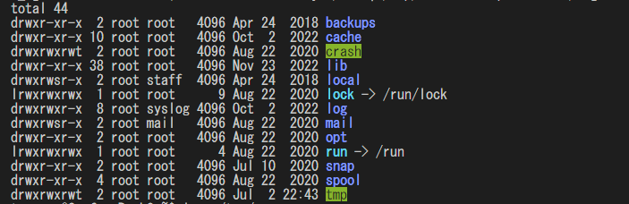

# regex-replacing-tee (rrtee)

## Overview

This is an extension of tee, a tool that performs replacements by regular expressions while writing text.

## Motivation

For example, if you save text containing colour codes with tee, the escape sequence will be included in the file.

```console
total 44
drwxr-xr-x  2 root root   4096 Apr 24  2018 ESC[0mESC[01;34mbackupsESC[0m
drwxr-xr-x 10 root root   4096 Oct  2  2022 ESC[01;34mcacheESC[0m
drwxrwxrwt  2 root root   4096 Aug 22  2020 ESC[30;42mcrashESC[0m
  :
```

Therefore, a separate operation to remove the escape sequence is required after the tee command, e.g. by using the sed command.

rrtee can apply a substitution to files directly without such post-processing.

## Usage

```bash
command | rrtee [-c config file path] <output file path>
```

## Example

```bash
ls -l --color=always /var | ./rrtee -c config.toml /tmp/aaa
```

Console shows the following:



On the other hand, `/tmp/aaa` has no escape sequences:

```console
total 44
drwxr-xr-x  2 root root   4096 Apr 24  2018 backups
drwxr-xr-x 10 root root   4096 Oct  2  2022 cache
drwxrwxrwt  2 root root   4096 Aug 22  2020 crash
drwxr-xr-x 38 root root   4096 Nov 23  2022 lib
drwxrwsr-x  2 root staff  4096 Apr 24  2018 local
lrwxrwxrwx  1 root root      9 Aug 22  2020 lock -> /run/lock
drwxrwxr-x  8 root syslog 4096 Oct  2  2022 log
drwxrwsr-x  2 root mail   4096 Aug 22  2020 mail
drwxr-xr-x  2 root root   4096 Aug 22  2020 opt
lrwxrwxrwx  1 root root      4 Aug 22  2020 run -> /run
drwxr-xr-x  2 root root   4096 Jul 10  2020 snap
drwxr-xr-x  4 root root   4096 Aug 22  2020 spool
drwxrwxrwt  2 root root   4096 Jul  2 22:43 tmp
```

## Configuration

You can add/delete a rule using `rules.` prefix.
